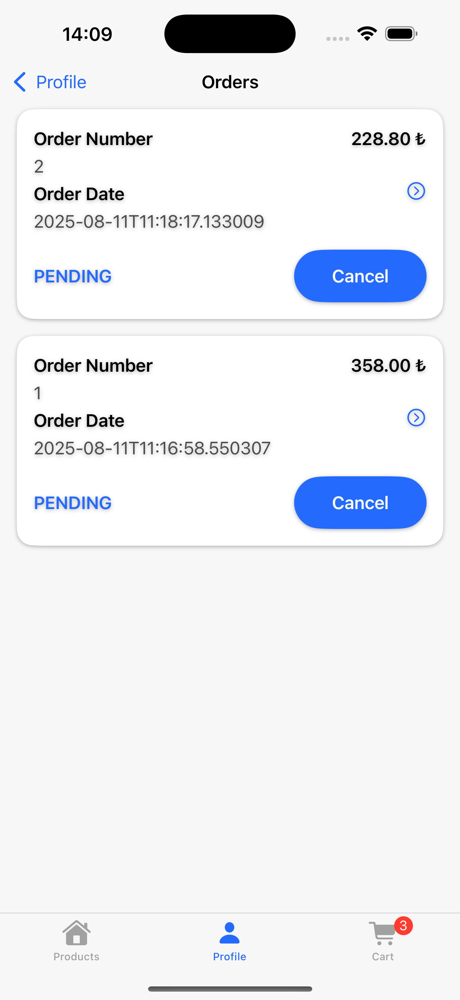

# 🛒 SwiftUI MVVM Clean Architecture E-Commerce App

A simple E-Commerce application built with **SwiftUI**.

## 🔗 Backend API

To run the REST API used in this project, you can check out the following repository:

[ECommerceApi - GitHub Repository](https://github.com/huseyinozkan/ECommerceApi)

## 🎥 Demo Video

https://github.com/user-attachments/assets/d7fe0f83-cdb7-499c-ab09-5e4fe6757b2b

## 📸 Screenshots

Here are some screenshots of the application:

### Light Theme

  
  
  
  
  
  
  
  
  
  
  
  
  

### Dark Theme

 
  
  
  
  
  
  
  
  
  
  
  
  

